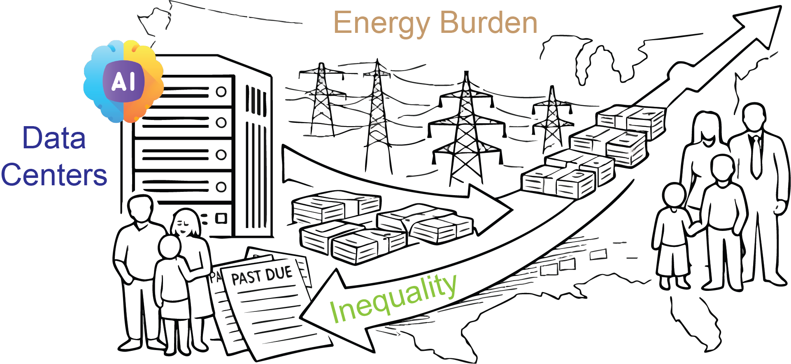
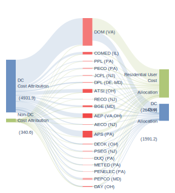
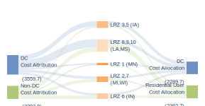
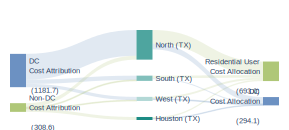
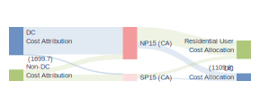

# Data Center–Driven Inequality and Energy Burden

  

This repository contains the data, code, and derived results used to quantify how data-center load growth affects **wholesale electricity prices**, **transmission cost allocation**, and downstream **burden and distributional outcomes** across the United States.

---

## Repository structure

- **00_code/** — Required code to reproduce the main calculations and figures.
- **01_tables/** — Panel dataset for estimating the impact of **ISO-level** data center capacity on wholesale prices.
- **01_tables_city/** — Panel dataset for estimating the impact of **non-ISO cities’** data center capacity on wholesale prices.
- **02_fuel_mix/** — Raw generation mix (fuel mix) data for each ISO.
- **03_aggressive_path/** — Inputs used to construct the **aggressive scenario** for data-center capacity trajectories.
- **04_load_and_costs/** — Source files for **transmission charges** and **long-term load forecasts**, plus extracted/cleaned tables.
- **04_rider/** — PUC docket documents and extracted tables used to compute **data-center transmission cost responsibility** (“rider” allocation).
- **05_burden/** — Price decomposition, projections, and fuel-price forecast files used in burden calculations.
- **06_AI_accept/** — AI tool usage (adoption) data and related computed outputs.
- **07_employment/** — State- and county-level employment data and processing outputs.
- **08_tax/** — Raw and processed data related to tax incentives / abatements.
- **figures/** — Static (SVG) and interactive (HTML) visualizations.
- **results/** — Paper-facing outputs (processed tables, model outputs, summary artifacts).

---

## Figures (2025 static previews → click for interactive HTML)

  
  

  
  

